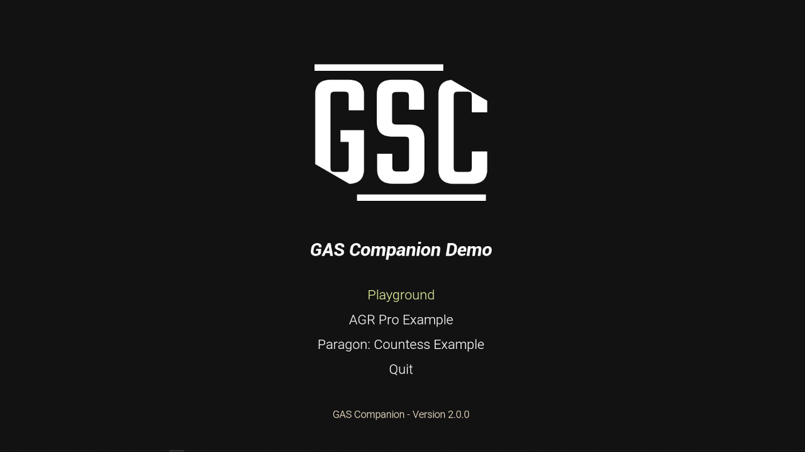
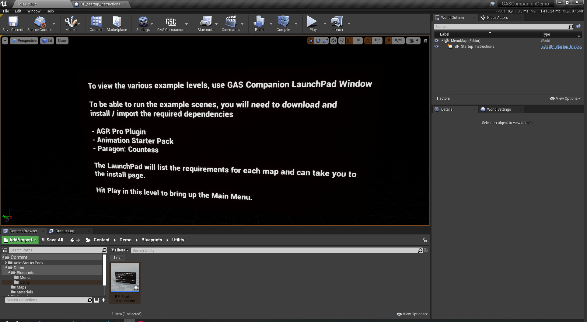

# GAS Companion Example Project

**Requires GAS Companion 2.0.0 or higher**

## Installation

1. Clone the repository using `git clone --recurse-submodules`
1. Open `GASCompanionDemo.uproject`

## Download Demo

1. Open the [releases page](https://github.com/GASCompanion/GASCompanionDemo/releases)
2. Download latest `GASCompanionDemo.zip`
3. Open `WindowsNoEditor/GASCompanionDemo.exe`

## Example Maps

- Playground: No dependency test / debug map
    - Basic "shoot" ability
    - Throw projectile
    - DefaultPawn / Actor example
- AGR Pro: requires AGR Pro Plugin and Animation Starter Pack
    - Demonstrates integration with AGR Pro
    - Throw Projectile
    - Spawn AI in level 
- Paragon Countess: requires Paragon Countess
    - Demo of the melee combo ability

## Documentation

- [GAS Companion Documentation](https://gascompanion.github.io/)